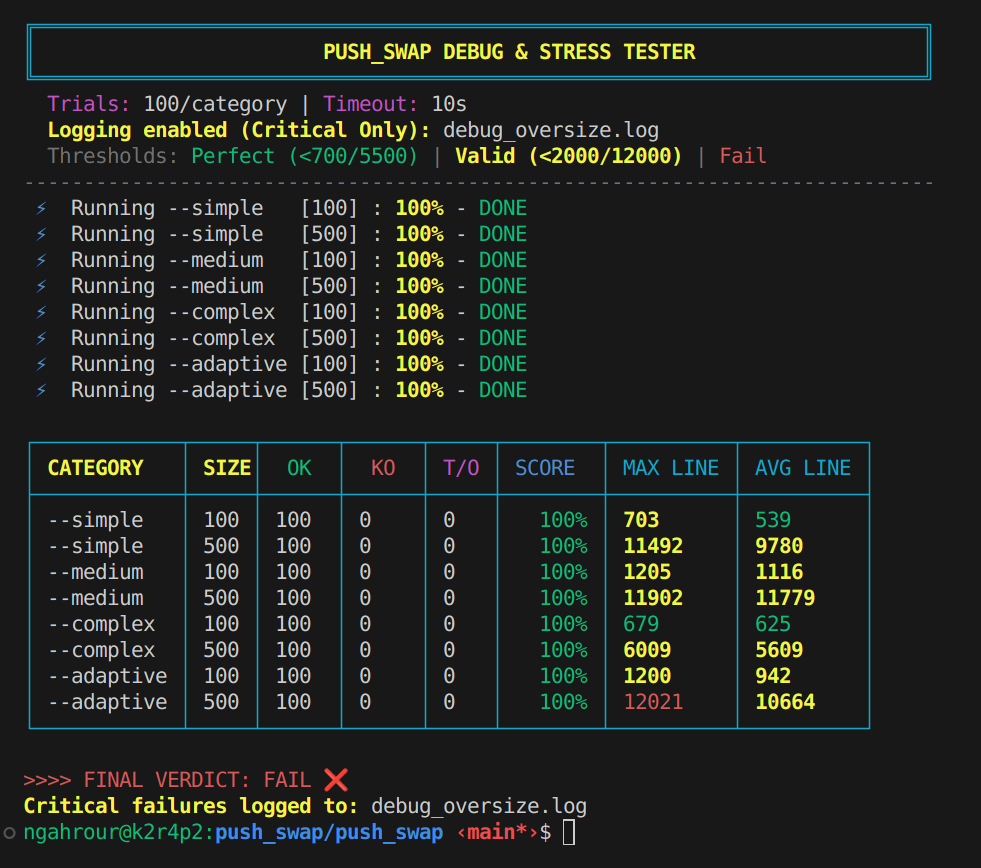

# 📦 Push_Swap Stress Tester


An intensive and visual testing tool for the **42 Push_swap** project. This script automates hundreds of tests to verify the robustness and accuracy of your sorting algorithm against various levels of disorder.

---

## 📸 Preview



---

## 🚀 Installation & Usage

### 1. Prerequisites
Ensure you have the following files in the **same folder**:
* `a.out` (your compiled Push_swap executable)
* `checker_linux` (the official checker)
* `benchmark.sh` (this script)

### 2. Launch
Give execution permissions and run the benchmark:
```bash
chmod +x benchmark.sh
./benchmark.sh
```
Or :
```bash
chmod +x benchmark.sh
./benchmark.sh -save
```
If you wish to record the cases that are KO (KO, timeout, too many ops)...

---

## 🛠️ Test Details
The benchmark executes **100 trials** for each of the following configurations:

| Flag | Size	| Disorder	| Description
| :--- | :--- | :--- | :--- |
| `--simple` | 100 & 500 | 20% | Nearly sorted list (stability test). |
| `--medium` | 100 & 500 | 50% | Moderate shuffle. |
| `--complex` | 100 & 500 | 80% | Heavy disorder (performance test). |
| `--adaptive` | 100 & 500 | Random | Randomized disorder rate (10% to 90%). |

### Key Features:
- **No Duplicates** : Uses Python's `random.sample` to guarantee unique integers.
- **Safety Timeout** : Automatically stops tests after 10s to prevent infinite loops.
- **Success Rate** : Displays an accurate success percentage for each category.

---

## ⚙️ Custom Configuration
If you use a different executable name or another tester (e.g., `push_swap` instead of `a.out`), simply modify the execution line in the benchmark.sh script:

```bash
# In benchmark.sh, replace './a.out' with your binary name
OUT=$(timeout "$TIMEOUT" ./push_swap $ARGS "$flag" 2>/dev/null)
```

## 📊 Result Glossary
- **OK** : The sort is validated by the checker.
- **KO** : Sorting error or invalid format (check your logic).
- **TIMEOUT** : Execution time exceeded 10 seconds.
- **SCORE** : Success percentage (must be 100% to validate the project).

*Générate by Gemini 3 Flash*
